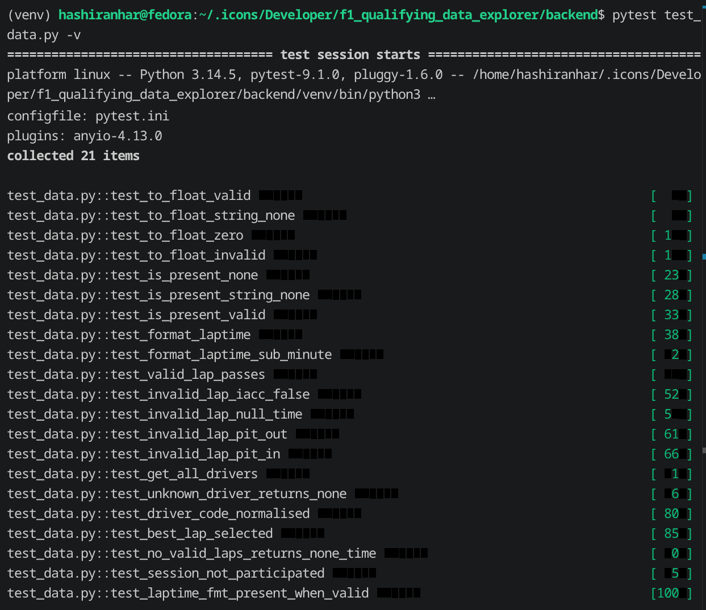
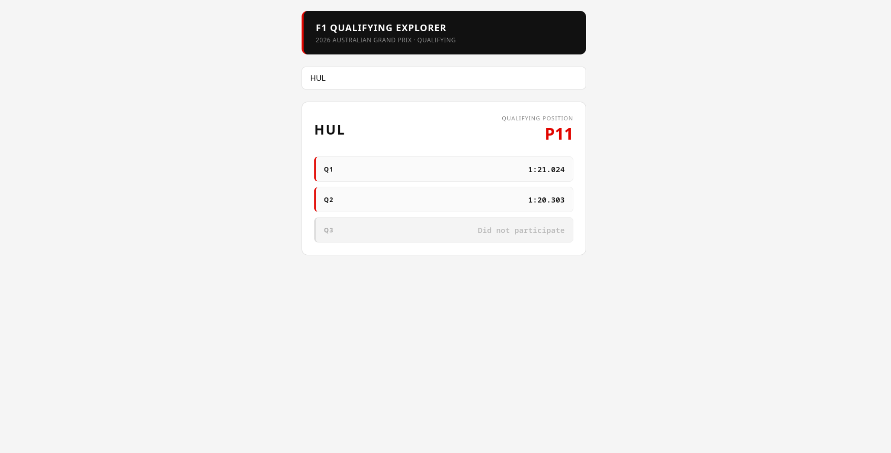

# F1 Qualifying Explorer

A web application for exploring 2026 Australian Grand Prix qualifying lap times.

---

## Screenshots

**Passing Tests**


**App — UI**


---

## Stack

| Layer | Technology |
|-------|-----------|
| Backend | Python 3.11, FastAPI, Pydantic |
| Frontend | React 18, Vite |
| Testing | pytest |
| Dev server | Uvicorn |

---

## Setup & Running

### Prerequisites

- Python 3.11+
- Node.js 22+

### Backend

```bash
cd backend
python3 -m venv venv

# Mac/Linux
source venv/bin/activate

# Windows
venv\Scripts\activate

pip install -r requirements.txt
uvicorn main:app --reload
```

Backend runs on `http://localhost:8000`.
Auto-generated API docs are available at `http://localhost:8000/docs`.

### Frontend

Open a second terminal:

```bash
cd frontend
npm install
npm run dev
```

Frontend runs on `http://localhost:5173`.

### Configuration

By default the frontend will point to `http://localhost:8000`.

---

## Running Tests

```bash
cd backend

# Mac/Linux
source venv/bin/activate

# Windows
venv\Scripts\activate

pytest test_data.py -v
```

21 tests were written that cover lap validation, best time selection, position derivation, formatting, and error handling.

---

## Architecture

The backend loads `data/session_laptimes.json`  into memory at app startup via FastAPI's lifespan hook and serves two main endpoints:

- `GET /api/drivers` — returns all driver codes available for the autocomplete
- `GET /api/driver/{code}` — returns the best valid lap per session and the qualifying position

The frontend is a one page only React app with a search/autocomplete input and a results card.

---

## Design Decisions & Trade-offs

**Why FastAPI + React**
FastAPI is the framework I used on my main personal project (CVPilot, 40+ endpoints),  I felt comfortable employing that backend stack on this project. I considered Svelte for the frontend as I've used it as the frontend of my projects, but defaulted to React given it is more commonly found in industry and the implementing would not be challenging. FastAPI's Pydantic integration gives the benefit of type-safe request/response schemas, and its auto-generated docs at `/docs` removed the need to set up Postman for detailed testing of the endpoints. 
**Why load data into memory at startup**
The dataset is read-only and quite small (~106KB). Loading it once at backend startup keeps the solution simple and stateless with no ddependencies. If the brief had required a more complicated solution it would've probably asked me to fetch live data directly from the internet, a per-request approach would have made more sense.

**Why derive qualifying position rather than read it from the dataset**
The `pos` field was null for records I investigated in the dataset. Position is therefore derived by ranking drivers by their best valid lap in the furthest session they reached , Q3 finishers ranked 1–10, Q2 eliminees 11–15, Q1 eliminees 16–20. I used Claude to sanity check this logic. 

**Lap validity**
A lap was considered valid by the code if: the lap time is non-null and is greater than zero, `IsAccurate` is true, and neither the `PitOutTime` nor `PitInTime` are there. The dataset stores nulls as string `"None"` rather than JSON null, which is handled in the code.

**What I would do with more time**
- Build a comparison system to compare different drivers and a time series view of all the timings of a driver 
- Sector time breakdown per session of driver 
- Use datasets from previous Grand Prix to validate the app

---

## Data Attribution

`data/session_laptimes.json` is sourced from the [TracingInsights 2026](https://github.com/TracingInsights/2026) repository, licensed under Apache 2.0. See `data/LICENSE.txt` and `data/ATTRIBUTION.md`.

---

## AI Usage

Claude (Anthropic) was used while coding to assist with:
- **Planning** — architecture decisions, endpoint design, and lap validity rules before writing up any  code
- **Frontend** — component structure and styling enhancements for the React UI
- **Automated tests** — generating the pytest test code and test data to check if functions are working

(Tech Spec generated by claude is included in repo)

All design decisions, trade-offs, and implementation details are on my own and I am able to explain and defend all parts of this submission.
